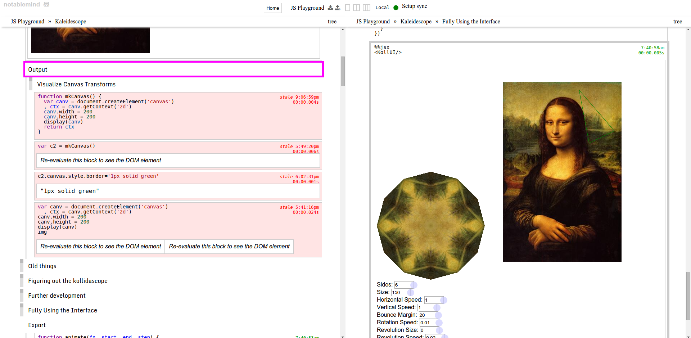

# Notablemind

All your mind. All your notes.

**Notablemind** is a life manager, and is useful for

- note taking
- journaling
- writing & composition
- task/project management
- rapid prototyping development

It draws inspiration from

- Workflowy
- Evernote
- Trello
- Whiteboards
- GinkoApp

It is in alpha stages right now. Many things are wonderful and I use it every
day, but some core things might change slightly in the near future.

## Screenshot

